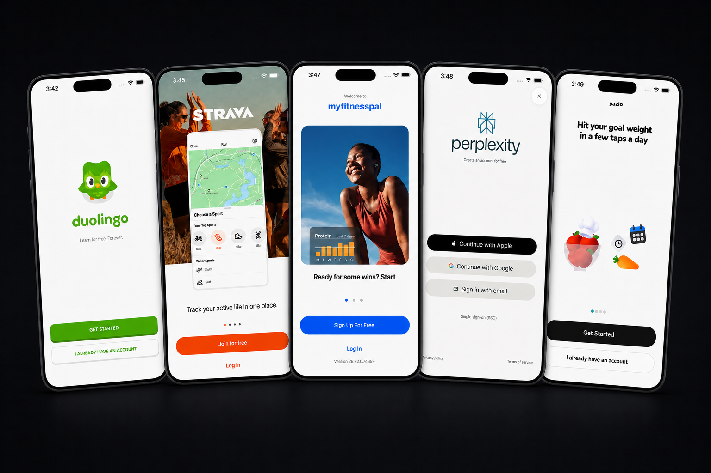
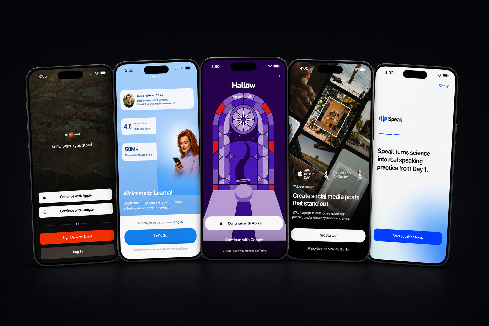

<p align="center">
  <strong>English</strong> · <a href="./README.ja.md">日本語</a>
</p>

<h1 align="center">Top Welcome Screens for SwiftUI</h1>

<p align="center">
  Ten native iOS splash, loading, welcome, and onboarding UI studies implemented entirely in SwiftUI.
</p>

<p align="center">
  
  
  
  <a href="./LICENSE"></a>
</p>





> [!IMPORTANT]
> **Educational reference only.** This independent project is not affiliated with or endorsed by any referenced company. Do not ship these studies unchanged. Replace every third-party name, logo, mascot, phrase, image, and brand color with authorized original material before public or commercial use. See [NOTICE.md](./NOTICE.md) and [asset provenance](./docs/ASSET_PROVENANCE.md).

## Native by design

This repository contains no React Native runtime, Expo router, JavaScript bridge, Reanimated dependency, CocoaPods dependency, or third-party Swift package. Layout, timing, easing, masking, interaction gating, reduced-motion behavior, images, and fonts are all handled by SwiftUI and Apple frameworks.

The implementation keeps the measured 640×1385 reference coordinate space so every recovered layout value and motion keyframe stays readable. `ReferenceCanvas` scales that canvas uniformly to the current iPhone display, while `MotionTimeline` exposes deterministic elapsed milliseconds to each screen.

## AI agent access through MCP

The repository includes an optional local, read-only MCP server for coding agents. It exposes the canonical screen catalog, selected Swift source, exact motion and interaction gates, assets, fonts, integration plans, validation, and reusable prompts without giving the server arbitrary filesystem or write access.

The MCP process is separate Python development tooling. It is not linked into the iOS target and does not add a runtime dependency to the native SwiftUI app.

```bash
python3 -m venv .venv
.venv/bin/python -m pip install -e Tools/WelcomeScreensMCP
.venv/bin/python Tools/WelcomeScreensMCP/scripts/stdio_smoke.py
```

See the [MCP setup and capability reference](./Tools/WelcomeScreensMCP/README.md) and the canonical [`welcome-screens.json`](./Catalog/welcome-screens.json).

## Requirements

- Xcode 26.4 or newer
- An installed iOS Simulator runtime matching the selected Xcode
- Deployment target: iOS 16.4+

## Run the gallery

Open [WelcomeScreenGallery.xcodeproj](./WelcomeScreenGallery.xcodeproj) and run the shared `WelcomeScreenGallery` scheme.

Command-line build:

```bash
xcodebuild \
  -project WelcomeScreenGallery.xcodeproj \
  -scheme WelcomeScreenGallery \
  -destination 'generic/platform=iOS Simulator' \
  CODE_SIGNING_ALLOWED=NO \
  build
```

Run tests on an available simulator:

```bash
xcodebuild \
  -project WelcomeScreenGallery.xcodeproj \
  -scheme WelcomeScreenGallery \
  -destination 'platform=iOS Simulator,name=iPhone 16 Pro' \
  CODE_SIGNING_ALLOWED=NO \
  test
```

If Xcode reports that no destination matches, install the corresponding runtime in Xcode Settings → Components or select an Xcode whose SDK matches an installed runtime.

## Select a screen

The gallery accepts deterministic launch arguments. Add them in Scheme → Run → Arguments, or pass them through `simctl launch`.

| Argument | Value | Meaning |
| --- | --- | --- |
| `-welcome-screen` | A screen ID below | Select the study |
| `-welcome-motion` | `1` or `0` | Play motion or render the exact final state |
| `-welcome-replay` | Any integer | Changing the value restarts the timeline |

Example:

```bash
xcrun simctl launch booted dev.appllama.welcomescreens \
  -welcome-screen scrl \
  -welcome-motion 1 \
  -welcome-replay 1
```

The same state can be changed while the app is running:

```bash
xcrun simctl openurl booted 'welcome-showcase://speak-learn?motion=1&replay=1'
```

## The ten studies

| Study | Screen ID | Native view | Duration |
| --- | --- | --- | ---: |
| Duolingo-inspired | `duolingo` | [`DuolingoWelcome`](./WelcomeScreenGallery/Features/Screens/DuolingoWelcome.swift) | 2.667 s |
| Strava-inspired | `strava` | [`StravaWelcome`](./WelcomeScreenGallery/Features/Screens/StravaWelcome.swift) | 6.600 s |
| MyFitnessPal-inspired | `myfitnesspal` | [`MyFitnessPalWelcome`](./WelcomeScreenGallery/Features/Screens/MyFitnessPalWelcome.swift) | 8.867 s |
| Perplexity-inspired | `perplexity` | [`PerplexityWelcome`](./WelcomeScreenGallery/Features/Screens/PerplexityWelcome.swift) | Still only |
| Yazio-inspired | `yazio` | [`YazioWelcome`](./WelcomeScreenGallery/Features/Screens/YazioWelcome.swift) | 1.733 s |
| onX Hunt-inspired | `onx-hunt` | [`OnxHuntWelcome`](./WelcomeScreenGallery/Features/Screens/OnxHuntWelcome.swift) | 1.467 s |
| Speak & Learn-inspired | `speak-learn` | [`SpeakLearnWelcome`](./WelcomeScreenGallery/Features/Screens/SpeakLearnWelcome.swift) | 4.940 s |
| Hallow-inspired | `hallow` | [`HallowWelcome`](./WelcomeScreenGallery/Features/Screens/HallowWelcome.swift) | 4.500 s |
| SCRL-inspired | `scrl` | [`ScrlWelcome`](./WelcomeScreenGallery/Features/Screens/ScrlWelcome.swift) | 1.999 s |
| Speak: Language Learning-inspired | `speak-language` | [`SpeakLanguageWelcome`](./WelcomeScreenGallery/Features/Screens/SpeakLanguageWelcome.swift) | 5.070 s |

Perplexity intentionally has no invented entrance animation because the research set contained only a final-state reference.

## Integrate one screen into another SwiftUI app

Copy only these transitive pieces:

1. The selected file under `WelcomeScreenGallery/Features/Screens/`.
2. `ReferenceGeometry.swift`, `ReferenceCanvas.swift`, `MotionTimeline.swift`, `ReplicaAssets.swift`, and `ReplicaControls.swift`.
3. `WelcomeAction.swift` if you want typed semantic actions.
4. The selected directory under `assets/welcome/` as a blue folder reference named `welcome`.
5. Only the Inter/Nunito font files used by that screen, then register them in `UIAppFonts`.

Mount the screen without surrounding safe-area padding or a visible navigation bar:

```swift
DuolingoWelcome(
    autoplay: true,
    replayKey: replayID,
    onActionPress: { action in
        switch action {
        case .duolingoGetStarted:
            onboarding.start()
        case .duolingoLogIn:
            router.showSignIn()
        default:
            break
        }
    }
)
.frame(maxWidth: .infinity, maxHeight: .infinity)
```

Every control remains disabled until its reference animation reaches the interactive state. With Reduce Motion enabled, `MotionTimeline` renders the completed state immediately.

## Architecture

```text
WelcomeScreenGalleryApp
└── WelcomeGallery                  launch args and deep links
    └── WelcomeScreen               typed screen switch
        └── *Welcome                one isolated screen and timeline
            ├── MotionTimeline      elapsed milliseconds + Reduce Motion
            ├── ReferenceCanvas     responsive 640×1385 coordinate system
            ├── ReplicaImage        bundled resource lookup
            └── ReplicaButton       action gate + accessibility label
```

- [`WelcomeScreenID`](./WelcomeScreenGallery/Domain/WelcomeScreenID.swift) is the single registry for IDs and durations.
- [`WelcomeAction`](./WelcomeScreenGallery/Domain/WelcomeAction.swift) contains 33 unique semantic actions.
- [`MOTION_SPEC.md`](./docs/MOTION_SPEC.md) is the audit source for exact timing.
- [`SWIFTUI_IMPLEMENTATION_GUIDE.md`](./docs/SWIFTUI_IMPLEMENTATION_GUIDE.md) contains the file-by-file integration contract and a ready-to-copy AI agent prompt.

## Verification

- Set `-welcome-motion 0` to make stable visual snapshots.
- Set `-welcome-motion 1` and change `-welcome-replay` to audit the authored timeline.
- Test Reduce Motion in Simulator accessibility settings; the final state should appear immediately.
- Run the Swift Testing target to protect registry uniqueness, screen count, and motion math.
- Simulator captures used in the two showcase panels are uniformly scaled by [`render-showcase.swift`](./scripts/render-showcase.swift); interface pixels are not regenerated.

## License and provenance

Code is GPL-3.0. Generated raster provenance is documented in [docs/ASSET_PROVENANCE.md](./docs/ASSET_PROVENANCE.md). Brand-related restrictions and attribution details are in [NOTICE.md](./NOTICE.md).
